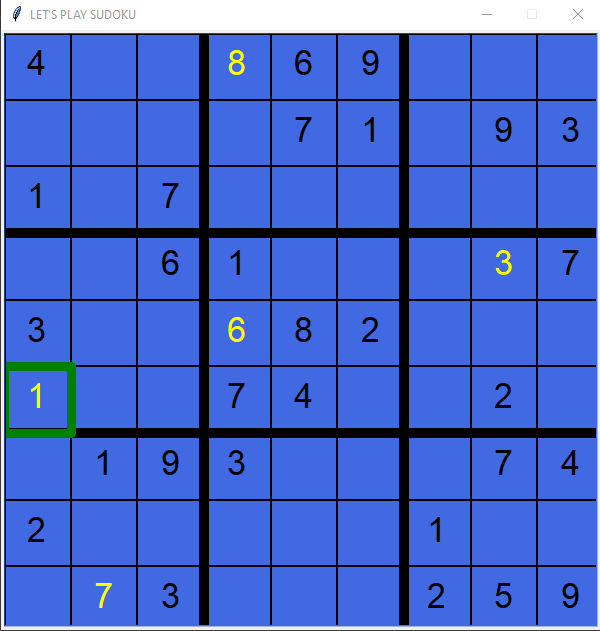
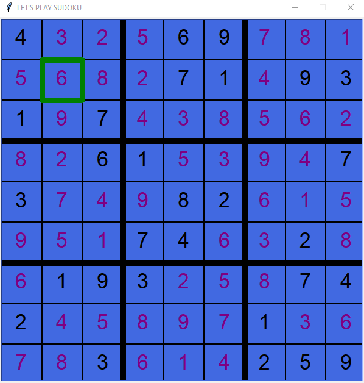

# PySudoku

A simple Sudoku game with python turtle graphics to pass around time.

## Installation

The only requirement is the following one:

```
* numpy=1.18.2
```

Use the following command to install it:

```
pip install numpy
```

After installing the numpy simply download the files in a folder and run the sudoku.py file. The file is compatible with
Python 2.7.x+ and Python 3.6.x+ and with Windows and Linux systems. To run the file use the next
command:

```
python sudoku.py
```

## Instructions

- Use the **mouse click** or  the **Up, Down, Left and Right Arrow Keys** to move the highlighted green box.

- To check if the solution is correct press **Enter**.

- To quit the game press **Esc**.

- To delete an input number press **Del**.

- To restart the game press **R**.

- To display the solution using the backtrack algorithm press **Space**.


## Images from gameplay

<p align="center">   
 
</p>

<p align="center">

</p>
